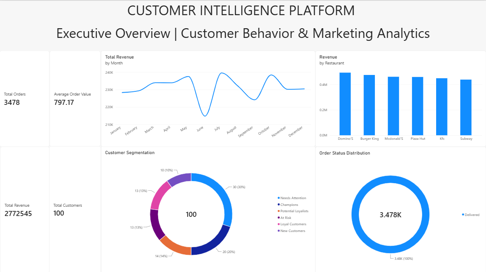
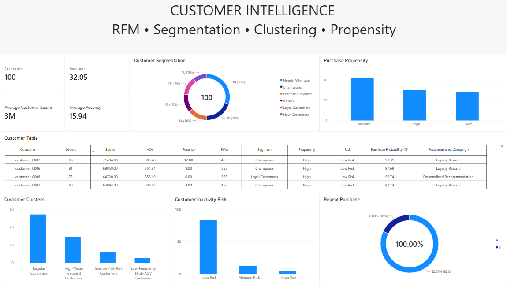
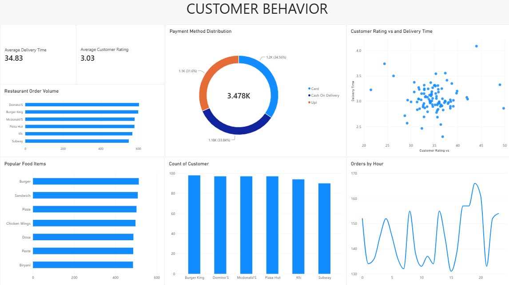
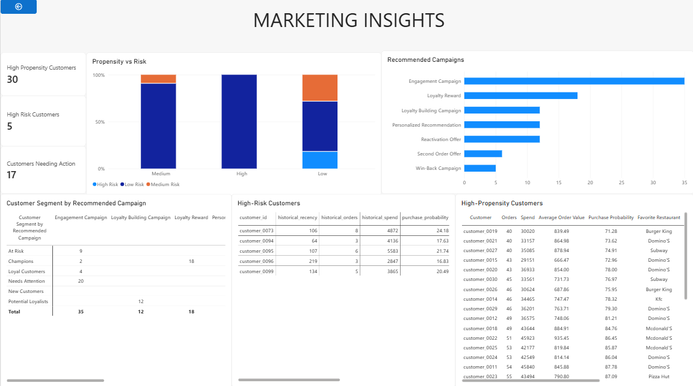

# Customer Intelligence & Marketing Analytics

## Project Overview

An end-to-end Data Analytics and Machine Learning project that analyzes
food-delivery order behavior to understand customer purchasing patterns,
segment customers, estimate repeat-purchase propensity, identify inactivity
risk, and generate explainable marketing campaign recommendations.

## Business Problem

Food-delivery businesses generate large volumes of transactional data.
This project analyzes customer behavior to answer questions such as:

- Which customer segments exist?
- Which customers are highly valuable?
- Which customers are becoming inactive?
- Which customers are likely to purchase again?
- How can customer groups be connected to marketing actions?

## Project Pipeline

Raw Data
→ Data Cleaning
→ Exploratory Data Analysis
→ SQL Analysis
→ RFM Segmentation
→ K-Means Clustering
→ Purchase Propensity
→ Inactivity Risk
→ Marketing Recommendations
→ Power BI Dashboard

## Dataset

The project uses a synthetic food-delivery dataset containing
7,002 orders and 100 analytical customer IDs.

The `customer_id` values are analytical identifiers created for this project
and do not represent real customer identities.

## Tech Stack

- Python
- Pandas
- NumPy
- Matplotlib
- Seaborn
- Scikit-learn
- SQL
- SQLite
- Power BI
- Jupyter Notebook

## Analysis Performed

### Data Cleaning
- Data type validation
- Missing-value checks
- Order-status filtering
- Transaction-level preparation

### Exploratory Data Analysis
- Revenue analysis
- Restaurant performance
- Food-item popularity
- Monthly revenue trends
- Ordering-hour analysis
- Customer spending analysis

### RFM Analysis
Customers were segmented using:
- Recency
- Frequency
- Monetary value

### K-Means Clustering

Customer behavior was clustered using:
- Recency
- Frequency
- Monetary value
- Average order value

Four clusters were selected based on the Elbow Method and Silhouette Score.

### Purchase Propensity

A class-weighted Logistic Regression model was used to estimate
30-day repeat-purchase propensity using historical customer behavior.

Model evaluation on the holdout set:

- Accuracy: 0.80
- Precision: 1.00
- Recall: 0.75
- F1 Score: 0.857
- ROC-AUC: 0.906

Because the dataset contains only 100 customers, the model evaluation
should be treated as a portfolio demonstration rather than a production
prediction system.

### Marketing Recommendations

Customer-level recommendations were generated using:
- Customer segment
- Purchase propensity
- Inactivity risk

## Key Results

- 7,002 orders analyzed
- 100 analytical customers
- 3,478 delivered orders
- ₹2.77M delivered-order revenue
- ₹797.17 average order value
- 6 RFM segments
- 4 K-Means clusters
- 30 high-propensity customers
- 5 high-risk customers

## Power BI Dashboard

### Executive Overview



### Customer Intelligence



### Customer Behavior



### Marketing Insights



## Project Structure

```text
Customer_Intellegence_System/
│
├── data/
│   ├── data_raw/
│   └── data_processed/
│
├── notebooks/
│   ├── 01_data_cleaning.ipynb
│   ├── 02_eda.ipynb
│   ├── 03_rfm_analysis.ipynb
│   ├── 04_customer_segmentation.ipynb
│   ├── 05_purchase_propensity.ipynb
│   └── 06_sql_analysis.ipynb
│
├── outputs/
│   ├── executive_overview.png
│   ├── customer_intelligence.png
│   ├── customer_behavior.png
│   └── marketing_insights.png
│
├── powerbi/
│   └── Customer_Intelligence_Dashboard.pbix
│
├── sql/
├── src/
├── .gitignore
└── README.md